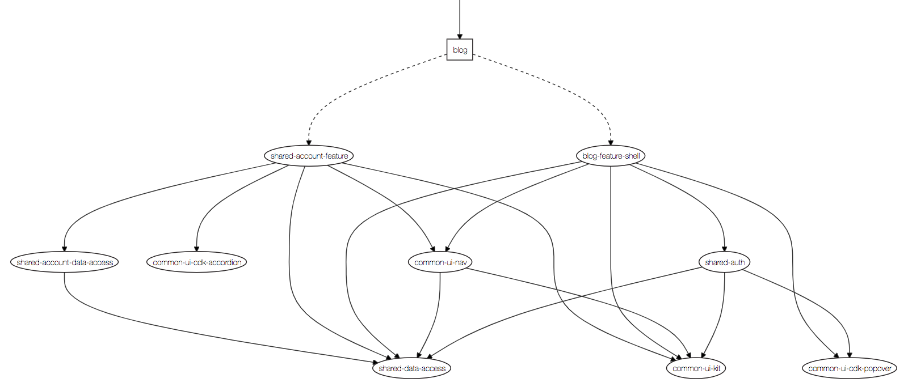

# Programando Web App

https://programando.web.app/

----------

Este projeto foi gerado usando [Nx](https://nx.dev).
_Ferramentas de desenvolvimento extensíveis para Monorepos._

## Entenda o workspace

Execute `nx dep-graph` para ver o diagrama de dependências do projeto.

----------

### 🔎 Início rápido e documentação

[Nx Docs](https://nx.dev/angular)

[10-minute video showing all Nx features](https://nx.dev/angular/getting-started/what-is-nx)

[Interactive Tutorial](https://nx.dev/angular/tutorial/01-create-application)
